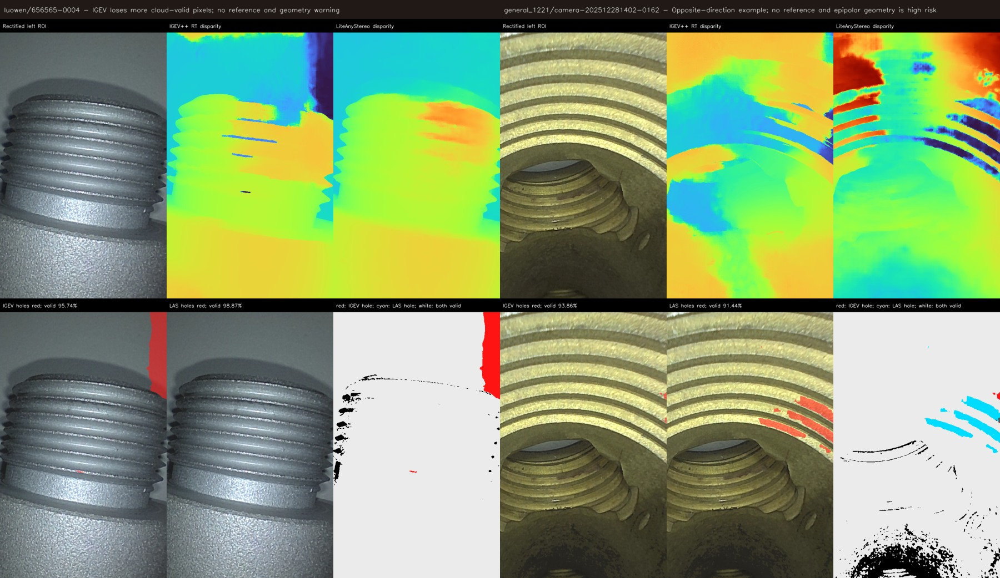
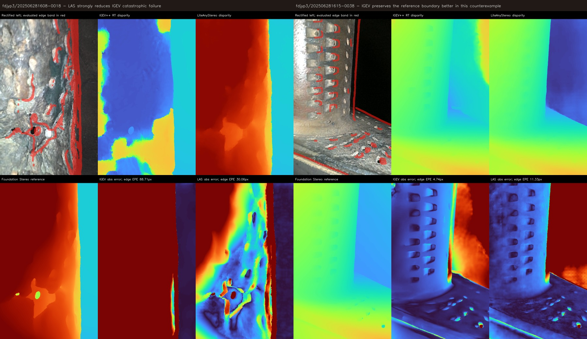
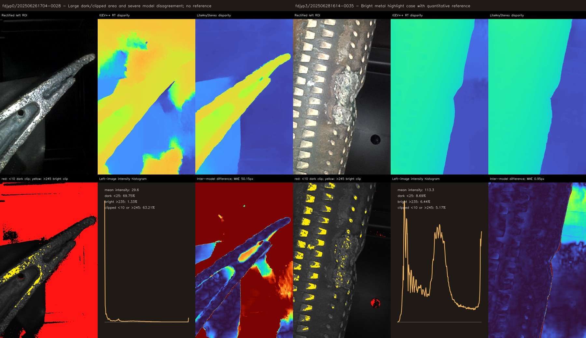
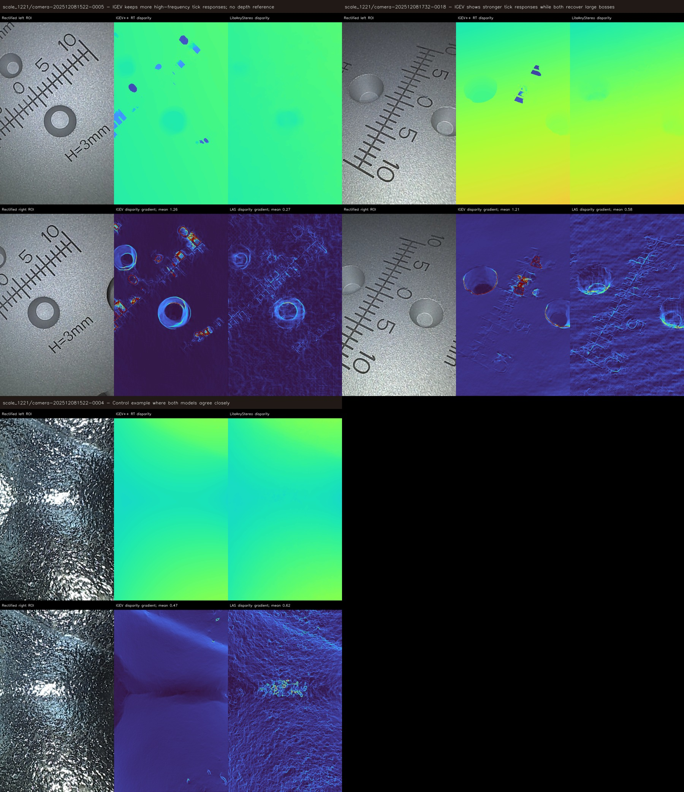

# IGEV++ RT 与 LiteAnyStereo 代表性案例分类

本目录从统一测试的 203 组结果中挑选了 9 个代表性案例，按空洞、边缘、曝光和刻度细节分类。选图先依据点云有效率、参考边缘误差、灰度分布和视差梯度筛选，再进行人工查看。

这里的“空洞”特指经过统一点云规则后无效的像素，即视差不在 `[5, 192] px`、重投影深度不在 `(0, 200)` 或图像被黑色阈值过滤。它不等同于网络输出 NaN；两套网络的原始视差均基本为有限值。

## 1. 空洞对比



| 场景 | IGEV 点云有效率 | LAS 点云有效率 | 观察 |
| :--- | ---: | ---: | :--- |
| `luowen/656565-0004` | 95.74% | **98.87%** | IGEV 独有空洞约 3.13%，集中在螺纹沟槽和右侧区域；LAS 填充更完整 |
| `general_1221/camera-202512281402-0162` | **93.86%** | 91.44% | 反例：LAS 独有空洞约 2.48%，集中在内螺纹区域 |

这两个场景都没有参考视差，且前者极线审计为 warning、后者为 high risk。因此只能评价“点云覆盖是否完整”，不能把 LAS 填满的区域直接认定为正确深度，也不能把 IGEV 覆盖更高直接认定为更准。

## 2. 边缘对比



边缘带由 Foundation Stereo 参考视差梯度提取并膨胀 7 像素得到。

| 场景 | IGEV 全图 EPE | LAS 全图 EPE | IGEV 边缘 EPE | LAS 边缘 EPE | 观察 |
| :--- | ---: | ---: | ---: | ---: | :--- |
| `fdjyp3/202506281608-0018` | 108.79 px | **12.32 px** | 88.71 px | **30.06 px** | IGEV 发生大范围灾难性失配；LAS 明显改善，但其 12.32 px 全图 EPE 仍不理想 |
| `fdjyp3/202506281615-0038` | **7.45 px** | 8.81 px | **4.74 px** | 11.33 px | 明确反例：IGEV 对立柱和背景交界的定位更接近参考 |

因此边缘能力不能用单张图概括。LiteAnyStereo 的优势主要是减少严重失效；IGEV 在部分正常场景的窄边缘上仍可能更好。

## 3. 曝光对比



| 场景 | 暗区 `<25` | 高亮区 `>235` | 截断区 `<10` 或 `>245` | 模型间 MAE | 观察 |
| :--- | ---: | ---: | ---: | ---: | :--- |
| `fdjyp0/202506261704-0028` | 69.75% | 1.33% | 63.21% | 50.15 px | 严重欠曝；IGEV 出现大范围错误平面，LAS 更连续，但无参考，不能证明 LAS 数值正确 |
| `fdjyp3/202506281614-0035` | 8.69% | 6.44% | 5.17% | 0.95 px | 金属高亮下两模型总体接近；IGEV/LAS 全图 EPE 分别为 2.81/2.98 px |

曝光案例说明输入质量是系统可行性的独立变量。严重截断会让两模型失去可验证纹理，平滑输出不应被直接解释为正确输出。

## 4. 刻度与细节对比



| 场景 | 模型间 MAE | IGEV 视差梯度均值 | LAS 视差梯度均值 | 观察 |
| :--- | ---: | ---: | ---: | :--- |
| `scale_1221/camera-202512081522-0005` | 1.156 px | **1.257** | 0.274 | IGEV 中印刷刻度响应明显，LAS 更平滑 |
| `scale_1221/camera-202512081732-0018` | 0.754 px | **1.211** | 0.581 | IGEV 中刻度响应更强；两者都恢复了较大的圆台结构 |
| `scale_1221/camera-202512081522-0004` | **0.216 px** | 0.468 | 0.624 | 控制样例：两模型视差整体非常接近 |

这个分类支持此前的肉眼观察：部分刻度图中 IGEV 确实保留了更多高频变化，LiteAnyStereo 会把它们平滑掉。但“看得见刻度”不必然表示深度更准确：

- 如果刻度是平面上的油墨或印刷纹理，真实几何本应接近平面，IGEV 的刻度形状可能是纹理复制伪影；
- 如果刻度是蚀刻、凸印或实际沟槽，保留刻度响应才可能是优势；
- 目前 5 组刻度图没有激光/结构光真值，无法在上述两种解释之间做定量裁决。

后续最有价值的补测是选一个已知平面印刷标尺和一个已知深度的蚀刻标尺，分别计算平面残差、沟槽深度误差和边缘定位误差。

## 文件结构

```text
representative_gallery/
├── 01_holes/                 # 单场空洞诊断图
├── 02_edges/                 # 单场边缘诊断图
├── 03_exposure/              # 单场曝光诊断图
├── 04_scale_details/         # 单场刻度/细节诊断图
├── 01_holes_overview.jpg
├── 02_edges_overview.jpg
├── 03_exposure_overview.jpg
├── 04_scale_details_overview.jpg
├── gallery_overview.jpg      # 四类总览
├── manifest.csv
└── manifest.json
```

分类图可由 `JieTai/experiments/01_stereo_comparison/rec_img_set/scripts/build_case_gallery.py` 基于既有推理结果重新生成，不需要再次运行模型。
